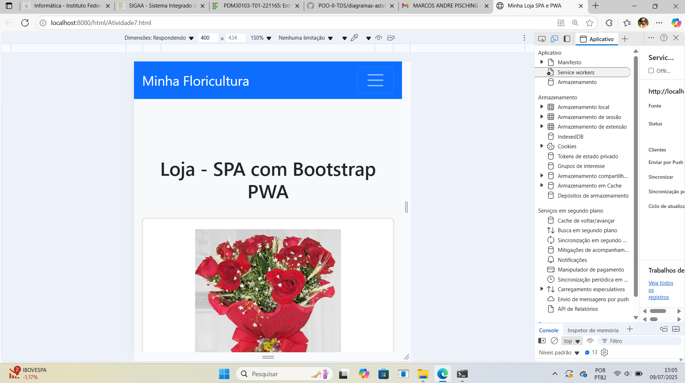

# 🌸 Floricultura Web

Aplicação web de uma floricultura desenvolvida com foco em **design responsivo**, garantindo uma experiência consistente tanto em dispositivos desktop quanto mobile.

---

## 🎯 Objetivo

Criar uma interface moderna e flexível para uma floricultura, permitindo navegação intuitiva e adaptação automática a diferentes tamanhos de tela.

---

## 🚀 Funcionalidades

- 🌷 Exibição de produtos (flores)
- 📱 Layout totalmente responsivo (mobile e desktop)
- 🖥️ Adaptação automática para diferentes resoluções
- 🖼️ Interface construída com Bootstrap
- 📂 Organização modular de arquivos
- ⚙️ Uso de dados estruturados (JSON)

---

## 📱 Responsividade

O sistema foi desenvolvido utilizando **Bootstrap**, garantindo:

- Layout adaptável para celulares, tablets e desktops
- Componentes flexíveis
- Melhor experiência do usuário em diferentes dispositivos

---

## 🛠️ Tecnologias Utilizadas

- HTML5
- CSS3
- JavaScript
- Bootstrap
- JSON

---

## 📂 Estrutura do Projeto

Atividade7/

│

├── css/

├── html/

├── images/

├── javaScript/

├── json/

│

├── manifest.json

├── service-worker.js

├── iniciar-projeto.bat

└── PrintMobile.png

---

## 📸 Interface



---

## ▶️ Como executar

```bash
1. Clone o repositório: git clone https://github.com/seu-usuario/seu-repositorio.git
2. Abra a pasta do projeto
3. Execute: iniciar-projeto.bat ou abra os arquivos HTML diretamente no navegador.

💡 Diferenciais
✅ Design responsivo (mobile-first)
✅ Uso de Bootstrap para UI moderna
✅ Estrutura organizada
✅ Simulação de aplicação web progressiva (PWA)


🔮 Melhorias futuras
Carrinho de compras
Integração com backend
Sistema de login
Filtro e busca de produtos


👩‍💻 Desenvolvido por

Andressa Maria de Ataides

📄 Licença

Projeto acadêmico para fins de estudo.
